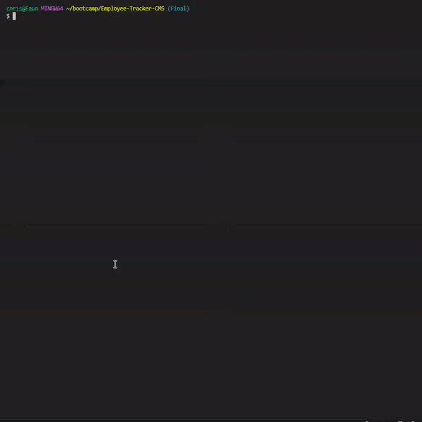
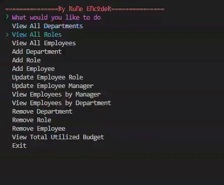
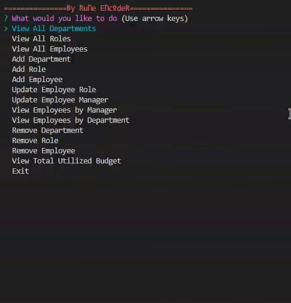
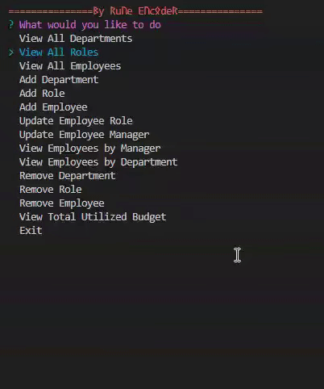

# Employee Tracker CMS [](https://opensource.org/licenses/MIT) 

 ## Description
 
  **Employee Tracker CMS Video Walkthrough Link: [Youtube Video](https://www.youtube.com/watch?v=MKeaD6Jyke8)** 
  
  View and manage your company's departments, roles and employees with this CMS.  
  This Employee CMS allows you to pull your companies data easily.  
  You are able to see employees, their managers, departments, roles, salaries and much more.  
  This CMS was created to facilitate obtaining data from a database.
  
  Technologies used:  
  This application uses MySQL: a relational database management system.  

 ## Table of Contents
 
 - [Installation](#installation)
 - [Usage](#usage)
 - [Contribution](#contribution)
 - [Tests](#tests)
 - [License](#license)
 - [Questions](#Questions)

 ## Installation
 
 **Before using this application, you will need to install:**  
 1. node.js
 2. npm 
 3. Inquirer 8.2.4 
 4. dotenv 16.3.1
 5. console.table 0.10.0
 6. mysql2 3.6.0
 7. figlet 1.6.0
 
 ## Usage
 
 1. Clone repository to your local machine.
 2. Open your terminal and type `mysql -u root -p` then log in with your password. 
 3. You will need to pre-populate your tables by running:  
 a. `SOURCE db/schema.sql;`  
 b. `SOURCE db/seeds.sql;`
 4. Afterwards, exit mysql and open node terminal and type `npm install -y` to install dependencies.  
 5. Run `node index.js` in the terminal.  
 6. The application has started. You will be able to:  
 a. You may view existing tables.  
 b. You may add new tables and data.  
 c. You may update existing tables and data.  
 d. You may delete existing tables and data. 

Note: Ensure you have a `.env` file in the root directory.  
The `.env` file must have:  
```DB_NAME='cms_db' DB_USER='root' DB_PASSWORD='Your_Password_Here```
 
 ## Contributing
 
 Created by: Christian Palacios
 
 To contribute to this repository you may contact me for further details.  
 Contact details below in the Questions Section.
 
 ## Tests
 
 **queries.sql:** The application was first tested with a queries.sql file prior to commiting SQL and mysql2 queries.  
 The following image demonstrates how the cms database was created and pre-populated.

  
 
 ## Credits

AskBCS Learning assisted me when I was stuck on a problem.  
 
 ## License

 [](https://opensource.org/licenses/MIT)  
 **The MIT License**  
 Please refer to the LICENSE in the repository.

 ## Questions
 
 **If you have any questions you may reach me at my email: [cont_rune_encoder@outlook.com](mailto:cont_rune_encoder@outlook.com)**  

 **Here is a link to my Github Profile: [Profile Link: rune-encoder](https://github.com/rune-encoder)**  

 **If you would like to check out my other projects visit this link: [Projects Link: rune-encoder](https://github.com/rune-encoder?tab=repositories)**  
    
 ## Preview Screenshots
 
 >**Get Tables:**  

  
 
 >**Create Tables:**  

  
 
 >**Update Tables:**  

  
 
 >**Delete Tables:**  

  
